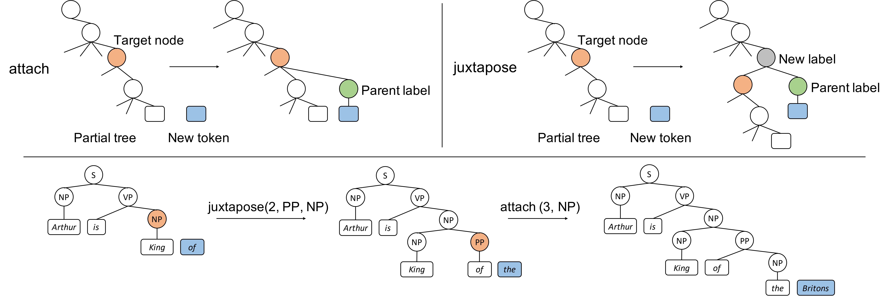

# Strongly Incremental Constituency Parsing with Graph Neural Networks




Code for the paper:  

[Strongly Incremental Constituency Parsing with Graph Neural Networks](https://arxiv.org/abs/2010.14568)      
[Kaiyu Yang](https://www.cs.princeton.edu/~kaiyuy/) and [Jia Deng](https://www.cs.princeton.edu/~jiadeng/)     
Neural Information Processing Systems (NeurIPS) 2020   

```
@inproceedings{yang2020attachjuxtapose,
  title={Strongly Incremental Constituency Parsing with Graph Neural Networks},
  author={Yang, Kaiyu and Deng, Jia},
  booktitle={Neural Information Processing Systems},
  year={2020},
}
```

## Requirements

1. Make sure your gcc version is at least 5 (`gcc --version`). I encountered segmentation faults with gcc 4.8.5. But if it works for you, it's probably fine. 
1. Download and install [Miniconda Python 3](https://docs.conda.io/en/latest/miniconda.html) (Anaconda should also work).
1. `cd` into the root of this repo.  
1. Edit [parser.yaml](./parser.yaml) according to your system. For example, remove [- cudatoolkit=10.2](./parser.yaml#L11) if you don't have a GPU. Change the version of cudatoolkit if necessary.  
1. Install Python dependencies using conda: `conda env create -f parser.yaml && conda activate parser`. If you have troubles with the aforementioned two steps, you may manually install the packages in [parser.yaml](./parser.yaml) in whatever way that works for you. 
1. Instatll [PyTorch Geometric](https://github.com/rusty1s/pytorch_geometric) following the [instructions](https://pytorch-geometric.readthedocs.io/en/latest/notes/installation.html). 
1. Compile the [Evalb](https://nlp.cs.nyu.edu/evalb/) program used for evaluation: `cd EVALB && make && cd ..`


## Data

We include the preprocessed PTB and CTB data in the [data](./data) directory. No additional data needs to be downloaded. For PTB, we use exactly the same data files as [self-attentive-parser](https://github.com/nikitakit/self-attentive-parser). For CTB, the data files are obtained following [distance-parser](https://github.com/hantek/distance-parser), which is also adopted by [HPSG-Neural-Parser](https://github.com/DoodleJZ/HPSG-Neural-Parser). It basically selects a subset of CTB 8.0 that corresponds to CTB 5.1.


## Training

Use [train.py](./train.py) for training models. By default, `python train.py` trains the parser on PTB using XLNet encoder and graph decoder. It saves training logs and model checkpoints to `./runs/default`. We use [hydra](https://hydra.cc/) to manage command-line arguments. Please refer to [conf/train.yaml](./conf/train.yaml) for the complete list of them. Below are some examples:

* To save results to `./runs/EXPID`, where `EXPID` is an arbitrary experiment identifier:
```
python train.py exp_id=EXPID
```

* To use BERT instead of XLNet
```
python train.py model=ptb_bert_graph
```

* To train on CTB using Chinese BERT as the encoder:
```
python train.py dataset=ctb model=ctb_bert_graph
```


## Results and Pre-trained Models

We provide hyperparameters, training logs and pre-trained models for reproducing our main results (Table 1 and Table 2 in the paper). In the paper, we ran each experiment 5 times with beam search and reported the mean and its standard errors (SEM). Whereas the numbers below are results of 1 run without beam search.


#### Constituency parsing on PTB

| Model         | EM       | F1      | LP      | LR       | Hyperparameters | Training log  | Pre-trained model | 
| ------------- | -------- | ------- | ------- | -------- | --------------- | ------------- | ----------------- |
| Ours (BERT)   | 57.41    | 95.80   | 96.01   | 95.59    | [ptb_bert_graph.yaml](./conf/model/ptb_bert_graph.yaml) | [ptb_bert_graph.txt](https://drive.google.com/file/d/1xk89sktiVDsVBRExBbQ0vHzLplI4G4Qa/view?usp=sharing)   | [ptb_bert_graph.pth](https://drive.google.com/file/d/10yW_lN48eAI4Ao2owqqZroGap9VaLonp/view?usp=sharing) |
| Ours (XLNet)  | 59.48    | 96.44   | 96.64   | 96.24    | [ptb_xlnet_graph.yaml](./conf/model/ptb_xlnet_graph.yaml) | [ptb_xlnet_graph.txt](https://drive.google.com/file/d/182Ejyqs1LoK_ttTJMkdUPqvMsQ503ILz/view?usp=sharing)   | [ptb_xlnet_graph.pth](https://drive.google.com/file/d/1sDuoeHDSzcT_MiXhSh_kzDqkCYswceEG/view?usp=sharing) |


#### Constituency parsing on CTB


| Model         | EM               | F1              | LP              | LR               | Hyperparameters | Training log  | Pre-trained model | 
| ------------- | ---------------- | --------------- | --------------- | ---------------- | --------------- | ------------- | ----------------- |
| Ours (BERT)   | 49.43            | 93.52           | 93.66           | 93.38            | [ctb_bert_graph.yaml](./conf/model/ctb_bert_graph.yaml) | [ctb_bert_graph.txt](https://drive.google.com/file/d/1VEHxje82dI7ZjlHAg3n9dAZaa97Xtm9T/view?usp=sharing)   | [ctb_bert_graph.pth](https://drive.google.com/file/d/1aVSFLjSOOsCzzLPU-ZRykirrYe6r-J-7/view?usp=sharing)  |


## Evaluation


To evaluate a model checkpoint on PTB:
```
python test.py model_path=PATH_TO_MODEL dataset=ptb
```

`PATH_TO_MODEL` is the path to the `*.pth` file generated by the training script or downloaded from our pre-trained models.


To evaluate on CTB:
```
python test.py model_path=PATH_TO_MODEL dataset=ctb
```


To evaluate with beam search:
```
python test.py model_path=PATH_TO_MODEL dataset=ptb/ctb beam_size=10
```

Please refer to [conf/test.yaml](./conf/test.yaml) for the complete list of command-line arguments.


#### Automatic Mixed Precision (AMP) Support
The evaluation script has [amp](https://pytorch.org/docs/stable/amp.html) enabled by default. In our experiments, amp speeds up the evaluation when using GTX 2080 Ti or Quadro RTX 6000, but it makes no difference when using GTX 1080 Ti. You may have to disable it when comparing speed with prior works without amp support.
```
python test.py model_path=PATH_TO_MODEL amp=false
```


#### GPU memory

We use a batch size of 150 during evaluation to fit our 11 GB GPU memory. Feel free to change it according to your hardware.
```
python test.py model_path=PATH_TO_MODEL eval_batch_size=XXX
```


## Parsing User-Provided Texts

You can use the attach-juxtapose parser to parse your own sentences. 
First, download the [spaCy](https://spacy.io/) models used for tokenization and POS tagging:
```
python -m spacy download en_core_web_sm
python -m spacy download zh_core_web_sm
```

Then, store the sentences in a text file, one sentence per line. See [input_examples.txt](./input_examples.txt) and [input_examples_chinese.txt](./input_examples_chinese.txt) for examples.  
Finally, run the parser from a model checkpoint `PATH_TO_MODEL`, saving the parse trees to a output file, e.g., `output.txt` or `output_chinese.txt`:
```
python parse.py model_path=PATH_TO_MODEL input=input_examples.txt output=output.txt
python parse.py language=chinese model_path=PATH_TO_MODEL input=input_examples_chinese.txt output=output_chinese.txt
```


## Static Type Checking

The codebase uses [Python 3 type hints](https://docs.python.org/3.6/library/typing.html) extensively. We use [mypy](http://mypy-lang.org/) for static type checking. Run `mypy` to typecheck the entire codebase. [mypy.ini](./mypy.ini) is the configuration file for mypy.


## Credits

* The code for the self-attention layers ([models/utils.py](./models/utils.py)) is based on [self-attentive-parser](https://github.com/nikitakit/self-attentive-parser). 
* We include the code of the [Evalb](https://nlp.cs.nyu.edu/evalb/) tool for calculating evaluation metrics. 
* The code is formatted using [](https://github.com/psf/black).
